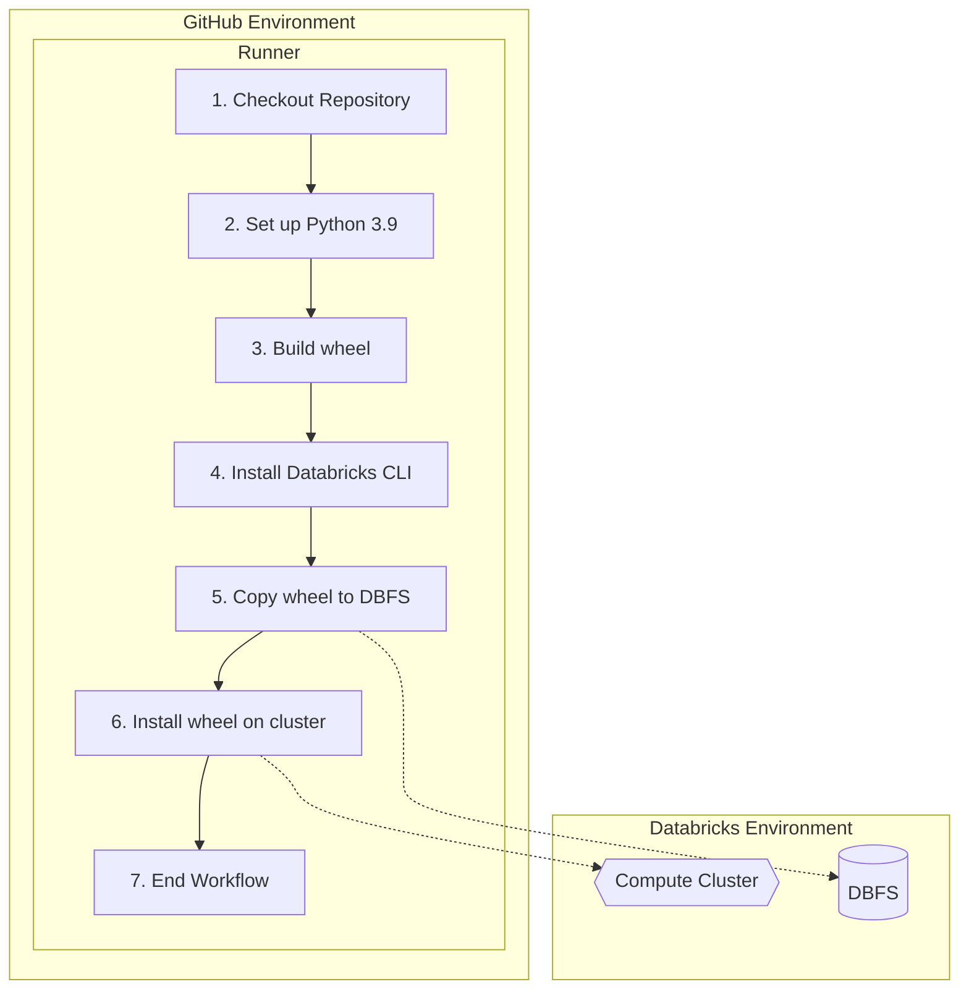

# Databricks CICD

## Automating custom package installation on Databricks clusters

This GitHub Actions workflow is designed to automate the process of building, uploading, and installing a Python package on a Databricks cluster, as well as updating a Databricks repository. The high-level purpose of each step is:

1. **Checkout**: Retrieve the source code from the repository.
2. **Set up Python 3.9**: Prepare the runner environment with Python 3.9, and cache the dependencies to speed up future builds.
3. **Build wheel**: Build the Python package as a wheel file (a distributable package format).
4. **Install Databricks CLI**: Install the Databricks command-line interface (CLI) to interact with the Databricks environment.
5. **Copy wheel to DBFS**: Upload the built wheel file to the Databricks File System (DBFS) under the `/libraries` folder.
6. **Install wheel on cluster**: Install the uploaded wheel file on the specified Databricks cluster.
7. **Update Databricks repo** (optional): Update the Databricks repository with the latest changes from the main branch.

The workflow is triggered by a push event or manually using the workflow_dispatch event.

### Prerequisites

1. Create a well-formed Python package ([for example](https://menziess.github.io/howto/create/python-packages/#1-packaging-setup)) in a repo on Github
2. Generate a [Databricks personal access token (PAT)](https://docs.databricks.com/dev-tools/auth.html#pat); this is the `DATABRICKS_TOKEN` env var
3. Identify your Databricks workspace URL; this is the `DATABRICKS_HOST` env var (`https://<instance-name>.cloud.databricks.com`)
4. Install the [Databricks CLI](https://docs.databricks.com/dev-tools/cli/index.html) locally
5. Identify the relevant Databricks cluster ID (where you want to install the package) using the CLI: `databricks clusters list`
6. Identify (optional) the relevant Databricks repo ID (corresponding to the repo for which you are building the package) using the CLI: `databricks repos list`
7. Create the following Github [repository secrets](https://docs.github.com/en/actions/security-guides/encrypted-secrets) your repo:
   1. `DATABRICKS_HOST`
   2. `DATABRICKS_TOKEN`
   3. `DATABRICKS_REPO_ID` (optional; remove the "Update databricks repo" step if not relevant)
